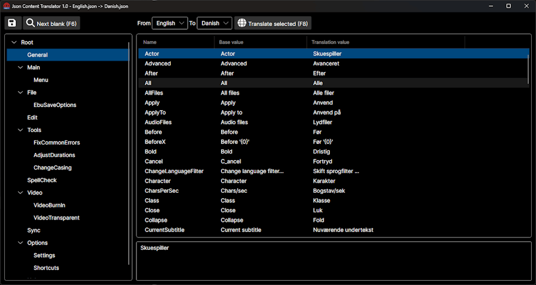

# JSON Content Translator

**JSON Content Translator** is a tool that helps you translate JSON language files from one language to another, making it easier to localize applications.

## Features

- Load JSON language files
- Translate content between languages
- Simple and intuitive interface